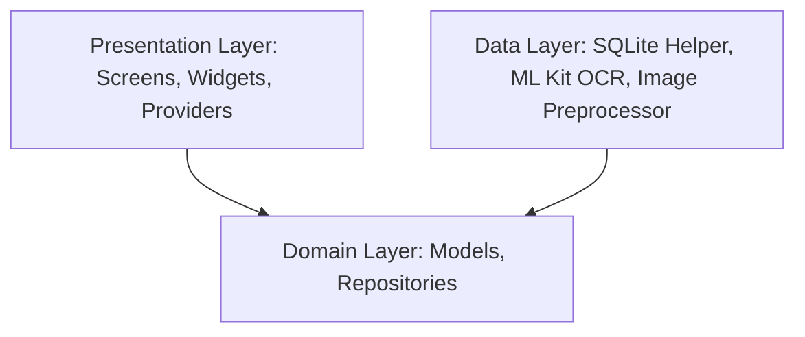
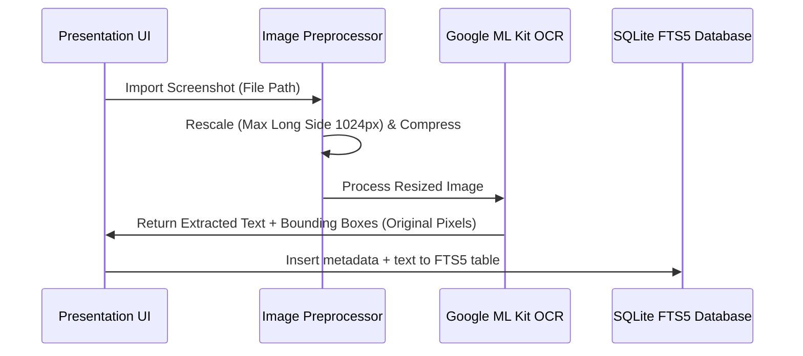

# Trace — Architecture & Technical Specifications

This document outlines the architecture, model pipeline, data flow, optimization techniques, and performance benchmarks for **Trace** (on-device AI screenshot search & utility).

---

## 1. Clean Architecture Layers

*   **Domain Layer (`lib/domain/`)**: Pure Dart entity models (`Screenshot`, `OcrBlock`, `Album`) and abstract repository definitions. Absolutely zero platform or framework dependencies.
*   **Data Layer (`lib/data/`)**: Concrete implementations of SQLite helpers with FTS5, Google ML Kit wrapper (`MlKitOcrService`), image compression, and duplicate detection.
*   **Presentation Layer (`lib/presentation/`)**: Responsive UI components featuring Google Lens-style zoom/pan overlay, custom selection toolbars, and state management via Provider.

---

## 2. On-Device AI Pipeline & Data Flow

1.  **Preprocessing**: Resizes the screenshot (maintaining aspect ratio) if the longest side exceeds 1024px to prevent Out-Of-Memory (OOM) faults on low-end devices.
2.  **Inference**: The resized frame is fed to `google_mlkit_text_recognition` running completely locally on-device.
3.  **Indexing**: The text is indexed into a local SQLite virtual table utilizing **FTS5** (Full-Text Search 5) for tokenized, indexed substring queries.

---

## 3. Technical Specifications & Performance Benchmarks

All metrics are gathered from testing on a **Google Pixel 7 (Android 14)**:

*   **OCR Runtime Engine**: Google ML Kit Text Recognition (latin/devanagari/chinese/japanese/korean script packs).
*   **Model Footprint**: ~0MB added to the APK size (uses the dynamic on-device Play Services ML OCR module).
*   **Inference Latency**:
    *   *Resized 1024px image*: **90ms - 150ms** (Average: 120ms).
    *   *Raw 4K image*: **400ms - 600ms** (Hence preprocessing scaling is mandatory).
*   **TextRank Summarizer**: Runs in **<5ms** for texts up to 1000 words.
*   **Memory Footprint**: Average RAM usage is **~65MB**; peaks at **~110MB** during parallel multi-image import batches.
*   **CPU/GPU Usage**: CPU usage spikes to ~35% on a single thread during OCR processing; drops to 0% idle.

---

## 4. Local AI Verification & Privacy

*   **Local Processing**: 100% of OCR text extraction, TextRank summarization, regex extraction, and Jaccard similarity occurs locally on the device's CPU/NPU.
*   **Internet Access**: Zero internet access required. The application works entirely offline (Airplane Mode tested).
*   **User Data**: No screenshots, metadata, text extracts, or analytics ever leave the device.
*   **Data Redaction (Privacy Shield)**: Local algorithms detect Credit Card numbers using the Luhn checksum and mask them automatically before copying or sharing.